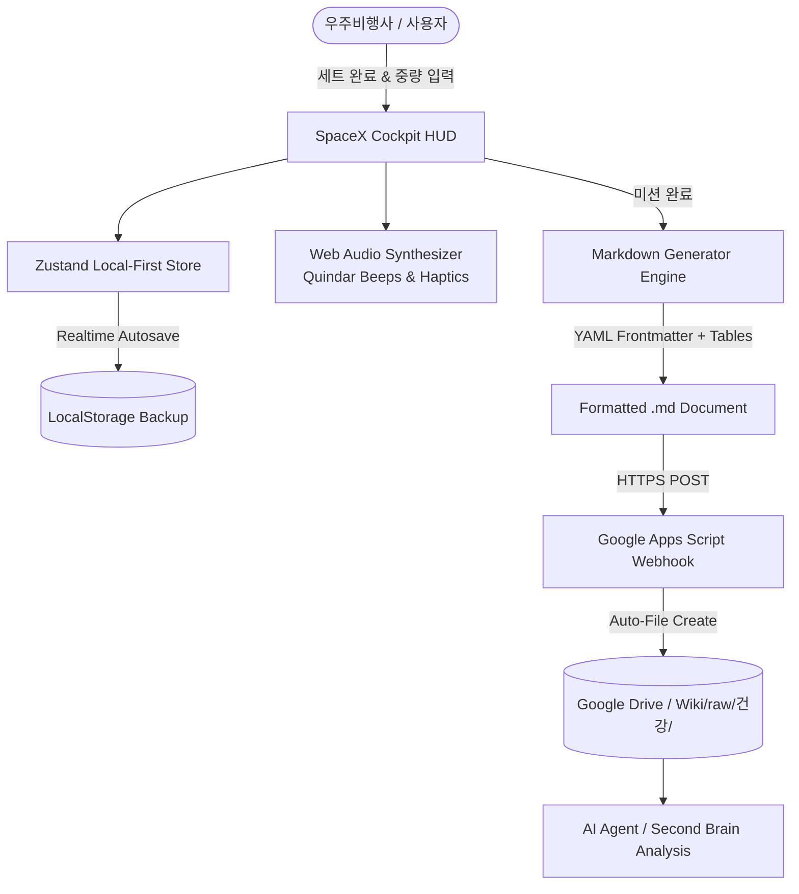

# IronLog V2: SpaceX Astronaut & Mission Control Spec

## 1. 개요 및 디자인 철학 (Overview & Design Philosophy)

IronLog V2는 단순한 헬스장 기록용 수첩을 넘어, 사용자가 훈련할 때마다 **"심우주 미션을 앞두고 극한의 신체 적응 훈련을 수행하는 스타쉽(Starship) 우주비행사"**가 된 듯한 몰입감을 제공하는 SF 시네마틱 피트니스 인터페이스입니다.

### 핵심 디자인 3원칙
1. **Astronaut Mission Cockpit (우주선 조종석 및 HUD)**:
   - 어둡고 밀도 있는 우주 공간(`canvas: #05070B`) 위에 선명한 레이저 사이안(`laser-cyan: #00F0FF`)과 플라즈마 앰버(`plasma-amber: #FF9100`) 고대비 발광 인디케이터를 적용하여 조도가 낮은 헬스장 환경에서도 압도적인 시인성과 몰입감을 선사합니다.
2. **Mission Telemetry Live Feedback (실시간 비행 데이터 계측)**:
   - 총 볼륨은 우주선이 들어 올린 `Payload Mass (kg / ton)`로, 세트는 `Stage Booster Burn`으로 시각화되며, 경과 시간은 로켓 발사 카운트다운 타이머 포맷(`T+ 00:45:12`)으로 표기됩니다.
3. **Adaptive Responsive Layout (반응형 관제센터 HUD)**:
   - **모바일**: 엄지손가락으로 탭하기 쉬운 1열 터치 친화적 콕핏 카드.
   - **태블릿/데스크톱**: NASA/SpaceX 관제센터처럼 좌측 실시간 텔레메트리 레이더 패널과 우측 인터랙티브 세트 실행 매트릭스로 자동 분할되는 2열 반응형 뷰.

---

## 2. 컬러 및 시각 아이덴티티 (Color & Visual Identity)

- **Canvas Deep Space (`#05070B`)**: 광활한 우주 진공을 상징하는 극심도 블랙.
- **Surface Cockpit (`#0B101D`) & Card (`#101827`)**: 티타늄 선체와 계기판 패널 질감.
- **Laser Cyan (`#00F0FF`)**: 주 추진체 점화, 세트 완수 체크, 주요 CTA 버튼.
- **Plasma Amber (`#FF9100`)**: 생명유지장치 궤도 휴식 타이머(Rest Timer) 및 주의 알림.
- **Hazard Red (`#FF3366`)**: 미션 중단(Abort) 및 비상 삭제.
- **Orbit Emerald (`#00FF9D`)**: 텔레메트리 정상(Nominal) 상태 및 Google Drive 동기화 완료 신호.

---

## 3. 오디오 & 햅틱 피드백 수트 (Mission Audio Suite)

Web Audio API 신디사이저를 통해 별도의 무거운 사운드 파일 없이 브라우저에서 순수 파형(Sine/Sawtooth)을 합성합니다.
- **Quindar Telemetry Beep (세트 완료)**: 아폴로/스페이스X 교신 특유의 2,525Hz + 2,475Hz 헤르츠 고주파 비프.
- **Thrust Ignition (운동 시작/완료)**: 저주파 서브베이스(Sub-bass) 램프 다운 사운드.
- **Countdown Pulse (휴식 3-2-1초)**: 계기판 경고음 틱.

---

## 4. 시스템 아키텍처 & 데이터 흐름 (System Architecture)

---

## 5. 검증 및 품질 기준 (Verification Standards)
- 디자인 토큰 및 반응형 뷰포트 완벽 호환 (375px 모바일 ~ 1920px 울트라와이드).
- 모든 세트 및 볼륨 계산의 무결성 단위 테스트 통과 (`Vitest`).
- Google Apps Script를 통한 Google Drive 마크다운 자동 생성 파싱 규격 100% 준수.
